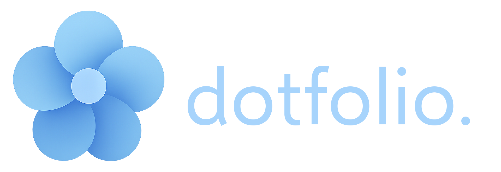

A minimalist, interactive, Windows 11 themed developer portfolio built with [Compose Multiplatform](https://github.com/JetBrains/compose-multiplatform).  
Inspired by Mica aesthetics, this project blends creativity with code — aiming to speak louder than words.

> 📎 “Think of it as a personal OS. One that boots into who I am.”

---

## 🌼 Features (Planned)

- ⚡️ Static desktop-like UI with interactive elements (icons, windows)
- 📁 Clickable icons that open custom "apps" (bio, CV, projects, contact)
- 📝 Launches with a central notepad window describing the author
- 🧠 Built entirely in Kotlin Multiplatform (WASM target)
- 🐧 Strong Linux and developer identity baked in the UX
- 🎨 Clean, elegant aesthetics with a focus on detail and interactivity


### \--> Preview is still in progress. The project just started. \<--

---

## 🌺 Goals

- Stand out in a sea of traditional portfolios
- Demonstrate creativity, UI/UX sensibility, and Kotlin/Compose skills
- Emphasize Linux proficiency and cross-platform versatility

---

## 🔧 Stack

- **Kotlin** — Main language
- **Compose Multiplatform (WASM)** — UI framework
- **GitHub Pages** — For deployment (expected static hosting)

---

## 🌻 Setup

> Clone and build the project locally.

```bash
git clone https://github.com/kosail/dotfolio.git
cd dotfolio
./gradlew wasmJsBrowserDistribution
```

---

## 💐 Contributing
Contributions are welcome! Feel free to fork the repository and submit pull requests. If you have ideas, suggestions, or bug reports, open an issue on GitHub.

---

[//]: # (## 🎒 What I learned from this project)

[//]: # (---)

## 📜 License


[GPLv3 (GNU General Public License v3)](LICENSE.txt) – Free to use, modify, and distribute as long as this remains open source, and it is not use for profitable purposes.

GPLv3 Logos:

    Copyright © 2012 Christian Cadena
    Available under the Creative Commons Attribution 3.0 Unported License.


---
> **Note:** dotfolio is a personal learning project and is not affiliated with Microsoft, Windows or any other brand or product.
---
dotfolio Copyright © 2025, kosail
<br>
With love, from Honduras.