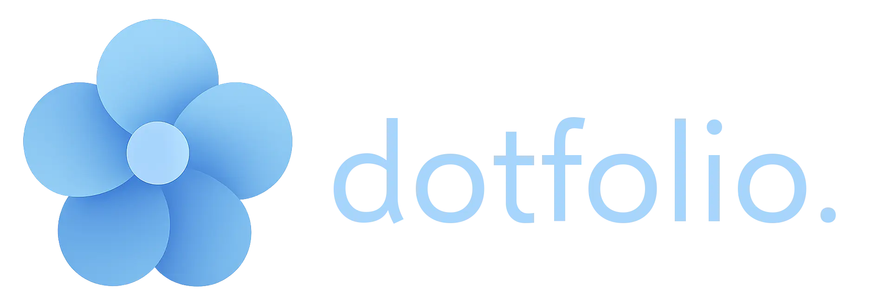
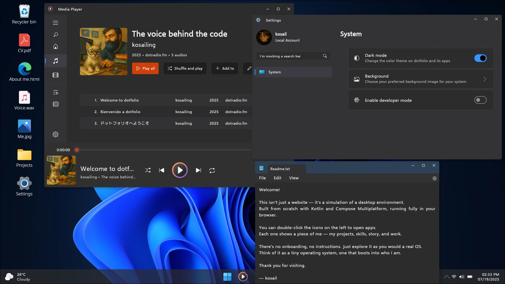
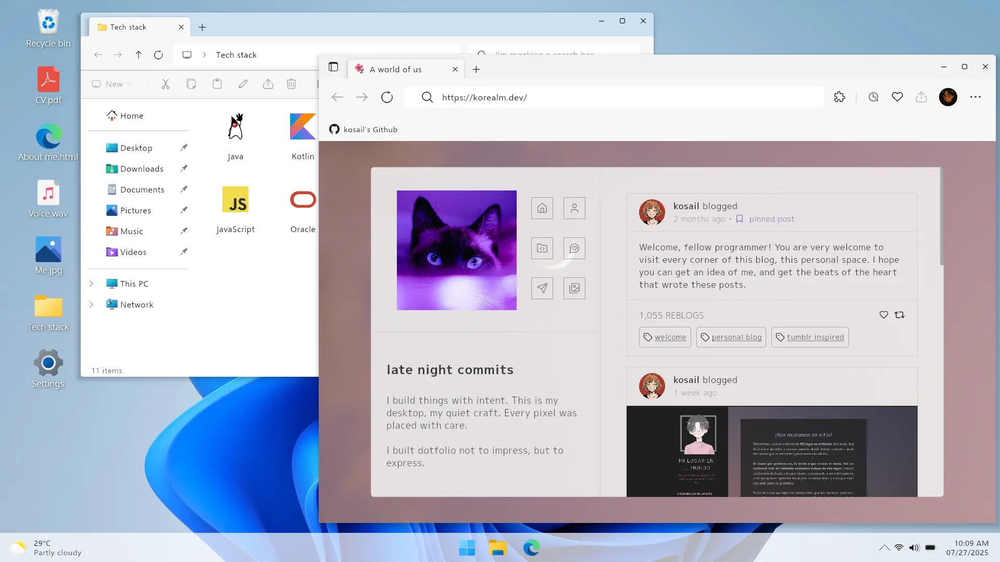
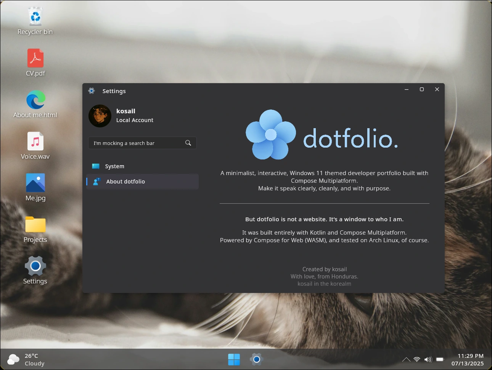
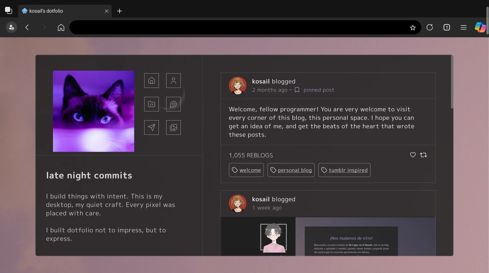
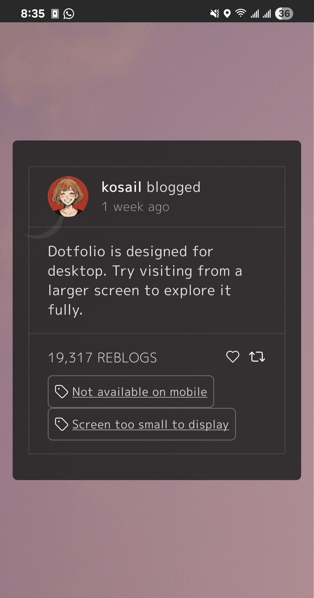

Dotfolio is my personal portfolio (dotfiles about me? Hence "dotfolio").
Instead of a standard website, I chose to create a narrative, an emotional experience disguised as an operating system.

Inspired by Windows 11 Mica aesthetics, this project aims to speak louder than words.

🧭 Built entirely with [Compose Multiplatform](https://github.com/JetBrains/compose-multiplatform) — using the WebAssembly + JS target.

---

## 🌺 Goal of this project:

The sole goal is to stand out in a sea of traditional portfolios. It's to tell, build an interactive story about myself. Taking this in mind, I focused on implementing only what is needed to tell this story, not to rebuild the actual functionality of an entire OS on Compose.

Make it speak clearly, cleanly, and with purpose. That's my goal, and the one of this project.

---

## 🌼 Features

- 💻 A static desktop environment that looks and feels like Windows 11, but minimal, soft, and handcrafted.
- 🗂️ It's fully interactive. Clickable desktop icons launch simulated apps like Notepad, Settings, a Media Player, Web Browser, and my CV
- 🌗 Seamless light and dark mode, and wallpaper customization option included (god I LOVED the resulting transition between dark/light mode)
- 🧠 Each “app” is not just aesthetic, but tells a part of the story: my skills, my personality, my design sense
- 🌐 Runs fully client-side. No backend, no trackers.
- 🤳 Render different versions of dotfolio depending on if it's a desktop, a tablet, or a mobile phone

> Dotfolio is structured like an operating system, but powered by storytelling. Just check it out:






On desktop, it loads the full version. On tablets, it loads just the content of dotfolio's web browser (the blog of myself), and on mobile it shows a nice message telling mobile is not currently supported
<details>
<summary>Open images</summary>




</details>

### Bugs

<details>
<summary>Show/Hide</summary>

1. ### Media player works seamlessly on web target, but in Desktop it has a bug in which if the audio is paused, then it cannot be played again.
    Although, it's okay. This project focuses on web target, and I use desktop implementation just for its hot reload capabilities, which really makes my life easier when quickly prototyping or fast debugging.
    
    Later note: It got worse xd now it doesn't even play audio at all... but meh.


2. ### Skiko is slow on the first load.
    I incorporated a JS target and did some tests, but I found out that the JS target is 2x times heavier and loads time are slightly longer than the WebAssembly one. Why? Hmm... I think it might be related to the bundle size. I'll keep the WASM target for now.
</details>

---

## 🌻 Setup

- Clone and build the project locally.

```bash
git clone https://github.com/kosail/dotfolio.git
cd dotfolio
./gradlew wasmJsBrowserDistribution # For web target
./gradlew hotRunJvm # For desktop jvm target
```

---

## 🔧 Stack & Resources
### Stack
- **Kotlin** — Main language
- **Compose Multiplatform (WASM/JS)** — UI framework
- **GitHub Pages** — For deployment

### Resources

#### -> Icons
- [Windows 11 icon theme, by yeyushengfan258](https://github.com/yeyushengfan258/Win11-icon-theme/)
- [Notepad Win11 icon, from Wikipedia Commons](https://commons.wikimedia.org/wiki/File:Notepad_Win11.svg)
- [Blanket app icon, by Rafael Mardojai](https://github.com/rafaelmardojai/blanket)

#### -> Wallpapers and images

<details>
<summary>Show/Hide</summary>

- [Windows 11 background light, from 4kwallpapers.com](https://4kwallpapers.com/abstract/windows-11-blue-stock-white-background-light-official-5616.html)
- [Windows 11 background dark, from 4kwallpapers.com](https://4kwallpapers.com/abstract/windows-11-dark-mode-blue-stock-official-5630.html)
- [Anime wallpaper, by Jensen Art Co. on Pixabay](https://pixabay.com/users/jensenartofficial-31380959/)
- [Cat wallpaper, by Zeke Tucker on Unsplash](https://unsplash.com/@zeketucker)
- [Honduras wallpaper 1, by Hector Emilio Gonzalez on Unsplash](https://unsplash.com/@hectoremilio)
- [Honduras wallpaper 2, by Ramon Flores on Unsplash](https://unsplash.com/@ramonantoniof)
- [Purple cat photo, by Adam Gonzales on Unsplash](https://unsplash.com/@adamgonzales)
- [Gnome screenshot, from Blur my shell GitHub repo, by aunetx](https://github.com/aunetx/blur-my-shell)
- Screenshot from the game "Flowers, le volume sur le printemps." Innocent Grey made this wonderful visual novel, and it's available on GOG for purchase.
- [Amberol music player screenshot, from FOSTips](https://fostips.com/amberol-music-player-beautiful-design/)
- [Windows 11 screenshot, from linkvegas12 on DevianArt](https://www.deviantart.com/linkvegas12/art/Fluent-Start-Menu-Style-For-Windows-11-1137827427)
- [Notion screenshots, taken from Gridfiti](https://gridfiti.com/notion-templates-aesthetic/)
- [macOS Sonoma screenshot, taken from Pinterest](https://www.pinterest.com/pin/756112224966502408/)
- [Glassmorphism example, taken from Pinteres](https://www.pinterest.com/pin/1124070388271624658/)
- [Web design screenshot, taken from Pinterest](https://www.pinterest.com/pin/397301998382015577/)
- [Mobile app screenshot, taken from Pinterest](https://www.pinterest.com/pin/1055599907266272/)


- [Java logo, from Wikimedia Commons](https://commons.wikimedia.org/wiki/File:Duke_%28Java_mascot%29_waving.svg)
- [Kotlin logo, from Wikimedia Commons](https://commons.wikimedia.org/wiki/File:Kotlin_Icon.svg)
- [Compose logo, from Compose official repo on GitHub](https://github.com/JetBrains/compose-multiplatform/blob/master/artwork/compose-logo.svg)
- [Spring Boot 3 logo, from Wikimedia Commons](https://worldvectorlogo.com/logo/spring-boot-1)
- [HTML logo, from Wikimedia Commons](https://commons.wikimedia.org/wiki/File:HTML5_Badge.svg)
- [CSS logo, from Wikimedia Commons](https://commons.wikimedia.org/wiki/File:CSS3_logo.svg)
- [JS logo, from Wikimedia Commons](https://commons.wikimedia.org/wiki/File:JavaScript-logo.png)
- [TS logo, from Wikimedia Commons](https://commons.wikimedia.org/wiki/File:Typescript_logo_2020.svg)
- [React logo, from Wikimedia Commons](https://commons.wikimedia.org/wiki/File:React-icon.svg)
- [Oracle logo, from Wikimedia Commons](https://commons.wikimedia.org/wiki/File:Oracle_logo.svg)
- [MS SQL Server logo, from Wikimedia Commons](https://commons.wikimedia.org/wiki/File:Microsoft_SQL_Server_2025_icon.svg)
- [Docker logo, from Wikimedia Commons](https://commons.wikimedia.org/wiki/File:Docker_(container_engine)_logo_(cropped).png)
- [Linux logo, from Wikimedia Commons](https://commons.wikimedia.org/wiki/File:TuxFlat.svg)
- [WordPress logo, from Wikimedia Commons](https://commons.wikimedia.org/wiki/File:WordPress_blue_logo.svg)

</details>

#### -> Fonts
- Main font: [Selawik font, from Microsoft](https://github.com/microsoft/Selawik)
- Japanese font: [M Plus 1p, from Google Fonts](https://fonts.google.com/specimen/M+PLUS+1p)

---

## 💐 Contributing
Contributions are welcome! Feel free to fork the repository and submit pull requests. If you have ideas, suggestions, or bug reports, open an issue on GitHub.

---

## 🎒 What I learned from this project
### 1. Scaling
Up until finishing this project, I realized that Compose doesn't automatically adapt my content to different resolutions, and that all this time I've been building just taking 1920x1080 resolution in mind. That was... ugh, a big headache.

"What am I supposed to do now with over a month of hard work? Refactor it over the whole project?." Dotfolio was never intended to be mobile first, but people will surely try it on mobile and I had to do something.

Thus, I decided to reuse the blog I made inside dotfolio to work as a sole website. Tried it, loved it. I think I'm quite lucky that this blog adapted almost perfectly to these resolutions that are over HD but less than Full HD. For mobile, I had no luck as it is more complicated. So I decided to limit the app reusing composables that I wrote for the blog.

From here and on, I'll take special attention not just to density, but resolutions.

### 2. Side Effects, Effect Handlers, and the State API
I think that this was one of the most important things that I learned by the end of this project.

I had doubts since the beginning of this journey on how it could be possible to call normal code from Composables (as Composables can be rebuilt many times during their lifecycle. Thus, they call the code inside them many times), but I didn't think too much on it as long as it worked. In my last project it just worked, but in dotfolio... well, it could have not been possible with Effect Handlers.

I still need to learn a lot more about these topics, and especially about derivatedState.

### 3. JavaScript is inescapable. Wherever you go, it will find you.
~~Brah, I need to learn JS.~~
I did learn JS. So goal accomplished!

---

## 📜 License


[GPLv3 (GNU General Public License v3)](LICENSE.txt) – Free to use, modify, and distribute as long as this remains open source, and it is not use for profitable purposes.

GPLv3 Logos:

    Copyright © 2012 Christian Cadena
    Available under the Creative Commons Attribution 3.0 Unported License.


---
> **Note:** dotfolio is a personal learning project and is not affiliated with Microsoft, Windows or any other brand or product.
---

dotfolio Copyright © 2025, kosail
<br>
With love, from Honduras.